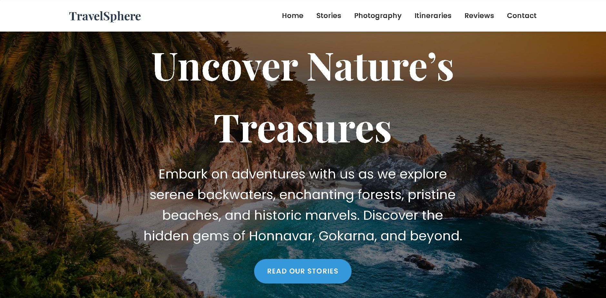

# Travel Blog
# Travel Blog


## Overview

**Travel Blog** is a modern and responsive template designed to captivate users with its engaging design and smooth interactivity. Built using AngularJS for dynamic content and Vanilla JavaScript for animations, this template is perfect for sharing travel experiences and stories.

## Features

- **Hero Section**: Prominent call-to-action button with animated text.  
- **Featured Stories**: Grid layout showcasing story cards with images and excerpts.  
- **Photography Section**: Grid of images with overlay titles.  
- **Travel Itineraries**: Dedicated section for itineraries with images and details.  
- **Newsletter Subscription**: Integrated form for updates.  
- **Footer**: Includes about information, quick links, and social media icons.  

## Technologies Used

- **AngularJS**: For dynamic content and data binding.  
- **Vanilla JavaScript**: Adds interactivity like smooth scrolling, animations, and parallax effects.  
- **GSAP**: Enables advanced animations and scroll-triggered effects.  
- **AOS (Animate On Scroll)**: Provides scroll-triggered animations.  
- **FontAwesome**: Supplies icons.  
- **Google Fonts**: Delivers stylish typography.  

## JavaScript Libraries

- **AngularJS**: Manages dynamic content and user interactions.  
- **GSAP**: Handles animations and scroll effects.  
- **AOS**: Adds animations triggered by scrolling.  

## Styles

- **CSS**: Custom styles for layout and aesthetics.  
- **Fonts**: Google Fonts for beautiful typography.  
- **Icons**: FontAwesome for high-quality icons.  

## Installation

1. Clone the repository:
   ```bash
   git clone https://github.com/Travel-Blog.git
